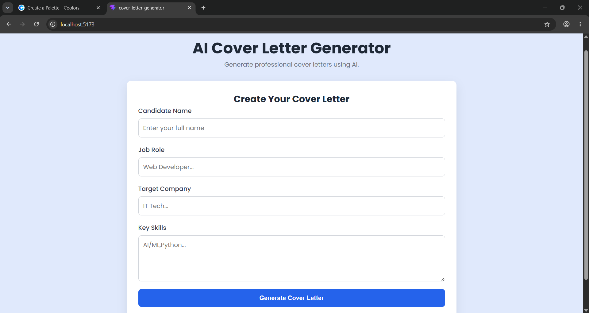
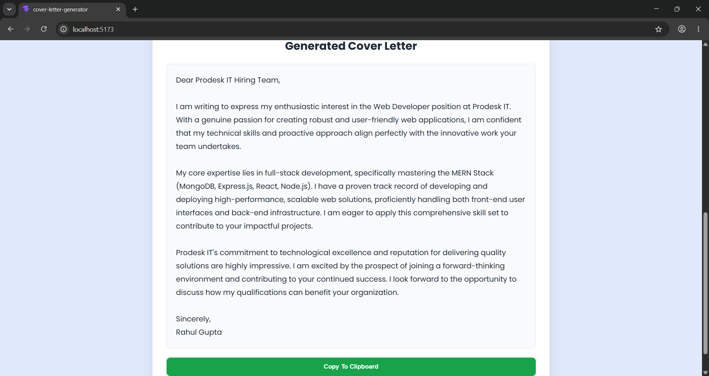

# AI Cover Letter Generator

An AI-powered Cover Letter Generator developed for Sprint 04 of the Prodesk IT Internship Program.

## Project Overview

This project is a modern web application that generates professional and personalized cover letters using the Google Gemini API.

Users can enter their details, including candidate name, job role, target company, and key skills. The application sends this information to the Gemini API and generates a customized cover letter that can be copied instantly.

The application includes:

- Responsive User Interface
- AI-powered Cover Letter Generation
- Google Gemini API Integration
- Secure API Key Management using .env
- Loading State while Generating
- Copy to Clipboard Functionality
- Form Validation
- Modern Card-Based UI

## Technologies Used

- React.js
- Vite
- JavaScript (ES6+)
- CSS3
- Google Gemini API
- Google Generative AI SDK
- Git & GitHub

## Features

- Generate personalized cover letters using AI
- Professional prompt engineering
- Secure API integration
- Copy generated letter with one click
- Responsive design
- Loading indicator while generating content

## Screenshot

## Live Demo
[text](https://ai-cover-letter-generator-seven.vercel.app/)

## GitHub Repository

https://github.com/abhishek-8899/Prodesk-IT-Sprint-4